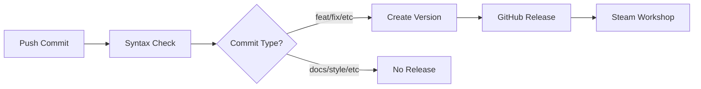

# OP Start System - Automated CI/CD Setup Complete! 🚀

Your Stellaris mod now has a comprehensive CI/CD pipeline with the following features:

## ✅ What's Now Automated

### 1. **Syntax Checking with CWTools**
- Runs on every push and pull request
- Validates your Stellaris mod syntax
- Provides inline feedback on GitHub PRs
- Supports English and German localizations

### 2. **Automatic Semantic Versioning**
- Analyzes your commit messages
- Automatically determines version numbers
- Creates GitHub releases with changelogs
- Updates `descriptor.mod` version field

### 3. **Steam Workshop Publishing**  
- Automatically publishes updates to Steam Workshop
- Generates Steam-formatted descriptions
- Includes version information and links to GitHub

## 🎯 How to Use

### Quick Start (Recommended)
Use **conventional commits** for automatic releases:

```bash
# For new features (1.0.0 → 1.1.0)
git commit -m "feat: add new asteroid mining bonuses"

# For bug fixes (1.0.0 → 1.0.1) 
git commit -m "fix: correct planet modifier calculations"

# For breaking changes (1.0.0 → 2.0.0)
git commit -m "feat!: redesign planet designation system"

# Push to trigger automation
git push origin main
```

### What Happens Next
1. ✅ CWTools checks your mod syntax
2. 📊 System analyzes commits and determines new version
3. 🏷️ Creates GitHub release with auto-generated changelog
4. 🚀 Publishes update to Steam Workshop (ID: 3498954181)
5. 📝 Updates `descriptor.mod` with new version

## ⚙️ Setup Requirements

You need to configure these GitHub repository secrets:

1. **STEAM_USERNAME** - Your Steam username
2. **STEAM_PASSWORD** - Your Steam password  
3. **STEAM_WORKSHOP_ID** - Set to `3498954181` (from your descriptor.mod)

## 📚 Documentation

- **[SETUP.md](.github/SETUP.md)** - Complete configuration guide
- **[CONVENTIONAL_COMMITS.md](.github/CONVENTIONAL_COMMITS.md)** - Commit message examples
- **[Workflow File](.github/workflows/ci-cd.yml)** - Technical implementation

## 🔄 Workflow Overview



## 🚨 Important Notes

- **Steam Guard**: If you have 2FA enabled, consider using a dedicated Steam account for automation
- **First Release**: Your first `feat:` commit will create version 1.0.0
- **Manual Releases**: Still supported for backward compatibility
- **PR Testing**: Pull requests only run syntax checks (no publishing)

## 💡 Examples of Commit Types

| Commit Type | Version Bump | Example |
|-------------|--------------|---------|
| `feat:` | Minor (1.0.0 → 1.1.0) | `feat: add orbital mining platforms` |
| `fix:` | Patch (1.0.0 → 1.0.1) | `fix: resolve resource calculation bug` |
| `feat!:` | Major (1.0.0 → 2.0.0) | `feat!: remove legacy planet types` |
| `docs:` | None | `docs: update installation guide` |
| `chore:` | None | `chore: cleanup old files` |

## 🎉 Ready to Go!

Your next push with a conventional commit message will trigger the full automation pipeline. Try it with:

```bash
git commit -m "feat: enable automated CI/CD pipeline"
git push origin main
```

Then watch the magic happen in the **Actions** tab of your GitHub repository!
